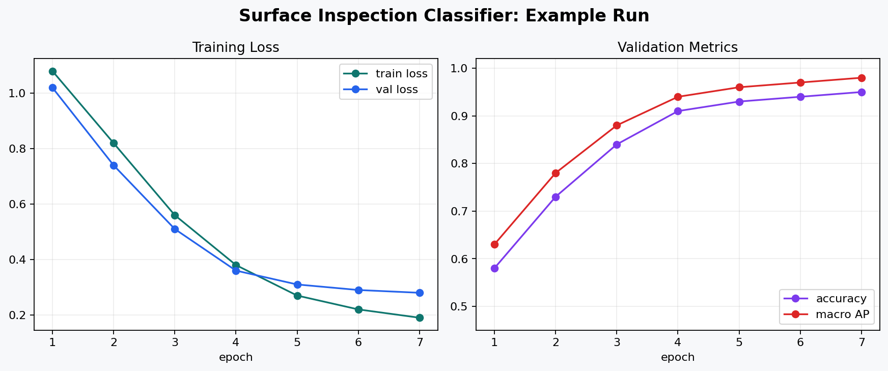
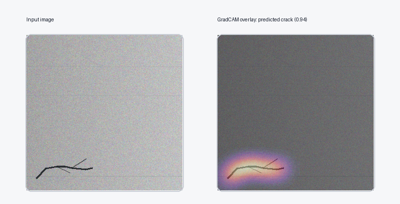
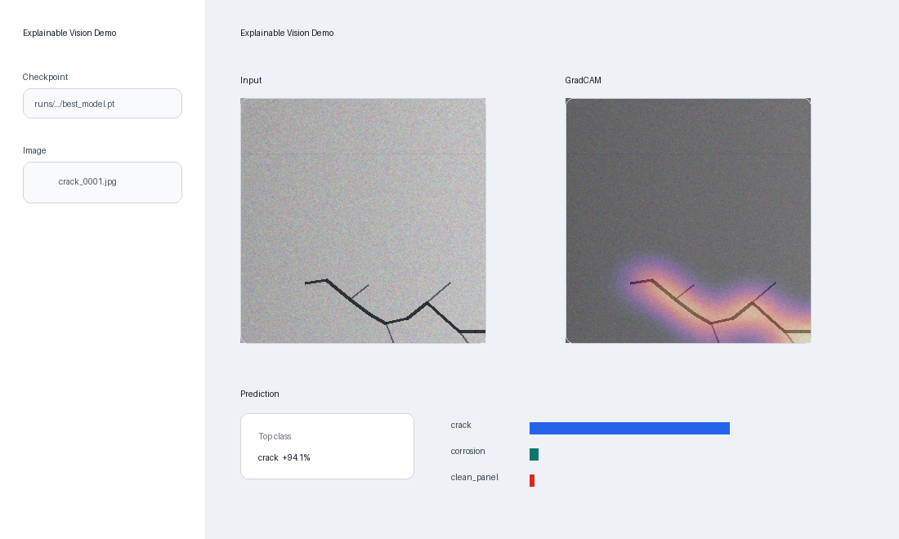
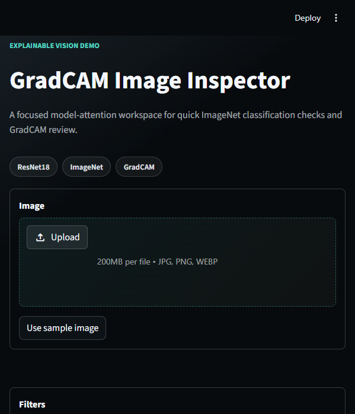
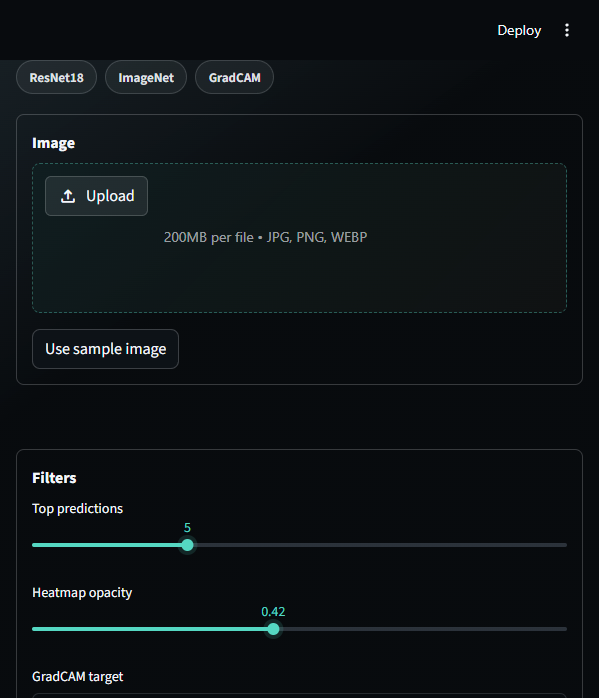

# Explainable Object Detection / Classification Demo

An end-to-end computer vision demo for image classification with explainability. The repo uses a transfer-learning-ready ResNet18/EfficientNet pipeline, reproducible dataset splits, accuracy/AUC/classification-mAP evaluation, GradCAM visualizations, and a small Streamlit UI for interactive inference.

The included sample dataset generator creates a tiny synthetic surface-inspection dataset so the full workflow can run without external data. The same training and evaluation code also works with any ImageFolder-style dataset.

## Result Screenshots











## What This Demonstrates

- Reproducible image dataset discovery and stratified `train` / `val` / `test` splitting.
- ResNet18 or EfficientNet-B0 classification heads for transfer learning or scratch training.
- Training loop with validation tracking, checkpointing, and learning-curve exports.
- Evaluation with accuracy, macro ROC-AUC, and macro average precision as classification mAP.
- GradCAM overlays that highlight image regions driving the predicted class.
- Streamlit UI for uploading an image, viewing top predictions, and inspecting GradCAM.

## Quickstart

```bash
python -m venv .venv
source .venv/bin/activate
pip install -e .
```

On Windows PowerShell:

```powershell
python -m venv .venv
.\.venv\Scripts\Activate.ps1
pip install -e .
```

Create a small demo dataset:

```bash
python scripts/make_sample_dataset.py --output data/surface_inspection --images-per-class 80
```

Train a classifier:

```bash
python -m xai_vision_demo.train \
  --data-dir data/surface_inspection \
  --output-dir runs/surface_resnet18 \
  --arch resnet18 \
  --epochs 5 \
  --batch-size 16 \
  --freeze-backbone
```

To fine-tune from ImageNet weights, add `--pretrained`. That may download torchvision weights the first time.

Evaluate the test split:

```bash
python -m xai_vision_demo.evaluate \
  --checkpoint runs/surface_resnet18/best_model.pt \
  --split-csv runs/surface_resnet18/splits.csv \
  --output-dir runs/surface_resnet18/eval
```

Create a GradCAM overlay for one image:

```bash
python -m xai_vision_demo.explain \
  --checkpoint runs/surface_resnet18/best_model.pt \
  --image data/surface_inspection/crack/crack_0001.jpg \
  --output runs/surface_resnet18/gradcam_crack.png
```

Launch the trained-checkpoint UI:

```bash
streamlit run app/streamlit_app.py
```

Or try the small pretrained ImageNet GradCAM demo without training a local model first:

```bash
streamlit run app/imagenet_gradcam_demo.py
```

This one is meant to be a quick inspection surface. It downloads torchvision's pretrained
ResNet18 weights the first time they are needed, then lets you upload a photo or use the
built-in coffee mug sample. From there you can change the number of predictions shown,
adjust the heatmap opacity, and pick which predicted class GradCAM should explain.

Under the hood, the demo preprocesses the image with the same transforms shipped with the
ResNet18 weights, runs a normal forward pass for class probabilities, then hooks the last
ResNet block for GradCAM. The selected class score is backpropagated into that block, the
gradients weight the activation maps, and the resulting heatmap is blended over the input
crop. In plain English: it shows the patch of the image the model leaned on most for the
class you selected.

The useful caveat: this is not the trained surface-inspection model. It is ImageNet
ResNet18, so it is best for everyday objects like mugs, dogs, cars, guitars, and fruit.
It will happily produce a heatmap for a defect image, but that does not mean the model
understands defects. GradCAM is also coarse; it is a debugging clue, not proof that the
model "reasoned" correctly.

## Dataset Format

Use an ImageFolder layout:

```text
data/my_dataset/
  class_a/
    image_001.jpg
  class_b/
    image_002.jpg
  class_c/
    image_003.jpg
```

The training command writes `splits.csv`, `classes.json`, `metrics_history.json`, `training_curves.png`, and `best_model.pt` to the selected run directory.

## Metrics

The evaluator reports:

- `accuracy`: top-1 accuracy.
- `macro_auc_ovr`: macro one-vs-rest ROC-AUC for multi-class classification.
- `macro_average_precision`: macro average precision. This is the classification analogue of mAP and is useful when comparing ranked confidence scores.

## Limitations And Next Steps

- The bundled dataset is intentionally synthetic and small; use a real domain dataset before drawing product conclusions.
- GradCAM is a localization aid, not a proof of causal reasoning.
- Object detection is not implemented in this repo. A YOLO variant could be added with bounding-box labels and detection mAP.
- The checkpoint Streamlit UI still expects a local model file; model registry or cloud deployment integration would be the next production step.
- The pretrained ImageNet demo is intentionally broad and lightweight. It is good for showing the explanation loop, not for validating a domain model.
- Add calibration metrics, test-time augmentation, and failure-case galleries for a stronger model audit.
